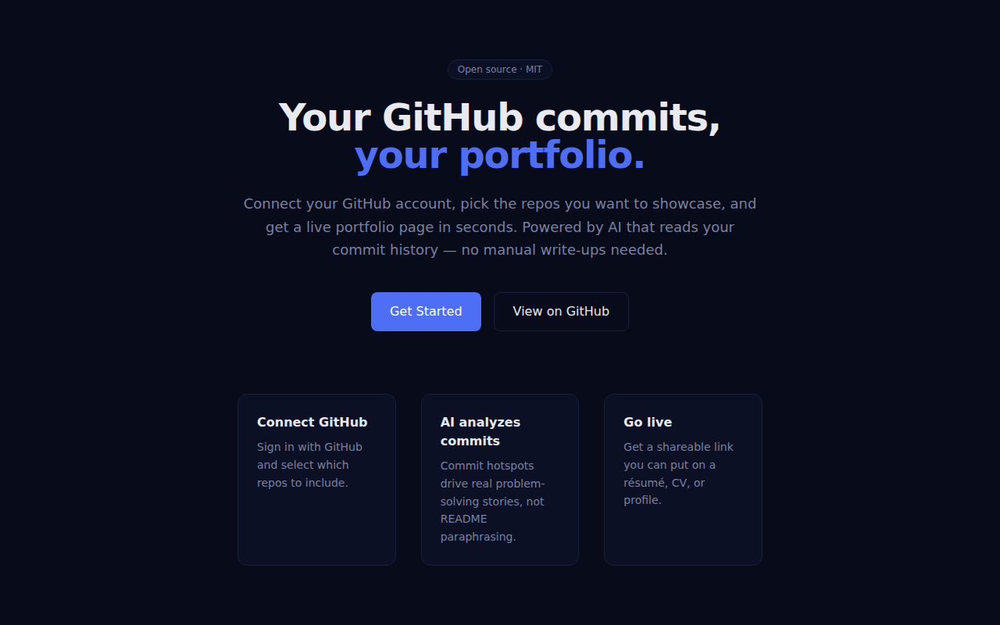
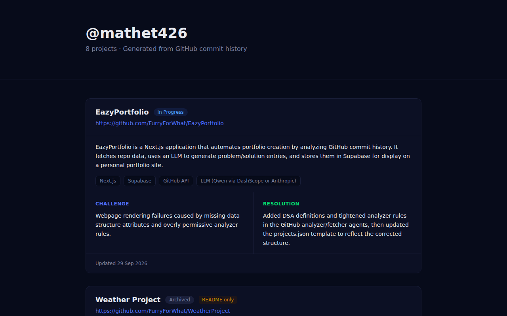
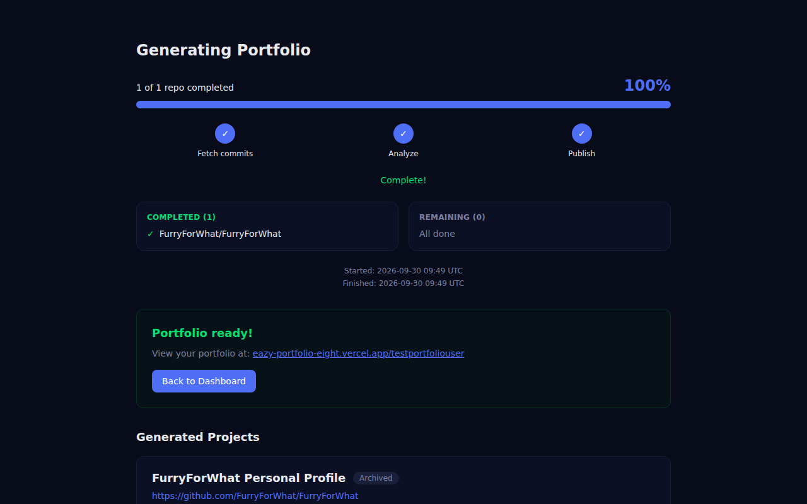
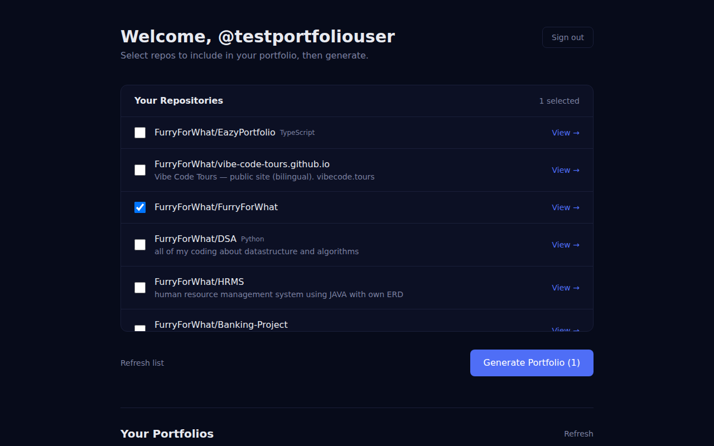
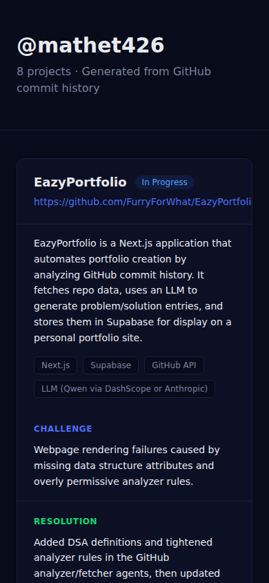

# EazyPortfolio

**Your GitHub commits, your portfolio.** Sign in with GitHub, pick the repos you want to
showcase, and get a live portfolio page at `/{username}` — each project card written from
your actual commit history, never from README paraphrasing.

**Live:** https://eazy-portfolio-eight.vercel.app



## What it does

1. **Sign in** with GitHub OAuth (Supabase Auth).
2. **Pick repos** on the dashboard — the list comes straight from your GitHub account.
3. **Generate**: a serverless run fetches commit hotspots over the GitHub REST API, asks an
   LLM to reason about them, validates the result, and publishes it to Supabase.
4. **Share** `/{username}` — a public, responsive page with a challenge/resolution card per
   project, plus a JSON feed at `/api/export/{username}`.

| Portfolio page | Generation progress |
| --- | --- |
|  |  |

| Dashboard (repo picker) | Mobile |
| --- | --- |
|  |  |

## Architecture

| Path | Role |
| --- | --- |
| `app/` | Next.js App Router — pages (`/`, `/dashboard`, `/generate/[runId]`, `/[username]`) and route handlers (`app/api/*`) |
| `components/` | Client components — repo picker, progress tracker, portfolio card |
| `lib/` | Supabase clients (anon/service-role/SSR), portfolio data access, date helpers |
| `pipeline/` | Framework-agnostic core: `fetcher.mjs` → `analyzer.mjs` → `validate.mjs` → `publisher.mjs`, orchestrated by `index.mjs` |
| `supabase/migrations/` | Postgres schema + row-level security |
| `tests/e2e.mjs` | Playwright end-to-end test |

Data flow:

```
GitHub OAuth → profile row (Supabase)
  → POST /api/sync  (snapshot of selected repos → runs row)
  → fetch (GitHub REST) → analyze (LLM) → validate → publish (Supabase)
  → GET /api/status/{runId}  (polled by the progress page; stale runs are reaped)
  → rendered at /{username} and /api/export/{username}
```

## Local development

```bash
npm install
cp .env.example .env.local     # fill in Supabase, GITHUB_TOKEN, ANTHROPIC_*
npx supabase start             # optional: local Supabase
npm run dev                    # http://localhost:3000
```

Env vars are listed in `.env.example`; `next.config.ts` fails a production build with the
exact list of missing build-critical keys instead of a cryptic runtime error.

## Testing

```bash
npx tsc --noEmit        # type check
npm run build           # production build
E2E_EMAIL=... E2E_PASSWORD=... E2E_EXPORT_USERNAME=... npm run test:e2e
```

`tests/e2e.mjs` (Playwright, headless Chromium) signs the test user in against Supabase,
then exercises the real app: repo selection + sync, progress polling to a terminal run
state, the public portfolio page, the JSON export, deselected-repo exclusion, stale-run
reaping, and a console-error check on every page. Point it at the deployment with
`E2E_BASE_URL=https://eazy-portfolio-eight.vercel.app`.

Screenshots and the console audit were captured with the Chrome DevTools MCP at fixed
viewports — 1280×800 desktop and 390×844 mobile (all seven live in `screenshots/`).

## Analytics

[Vercel Web Analytics](https://vercel.com/docs/web-analytics) (`@vercel/analytics`),
rendered in `app/layout.tsx`. Page views only, no cookies, no third-party identifiers —
the `_vercel/insights/script.js` beacon is served from the same origin.

## License

[MIT](LICENSE)
