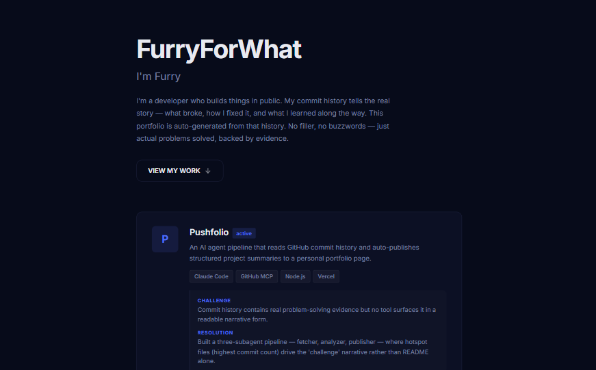
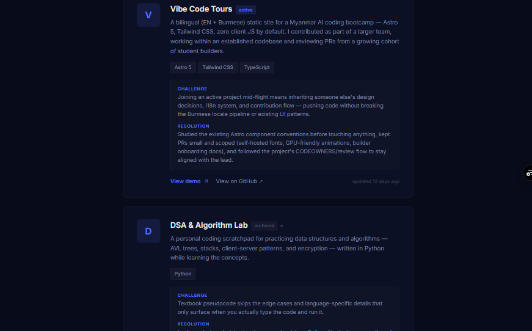
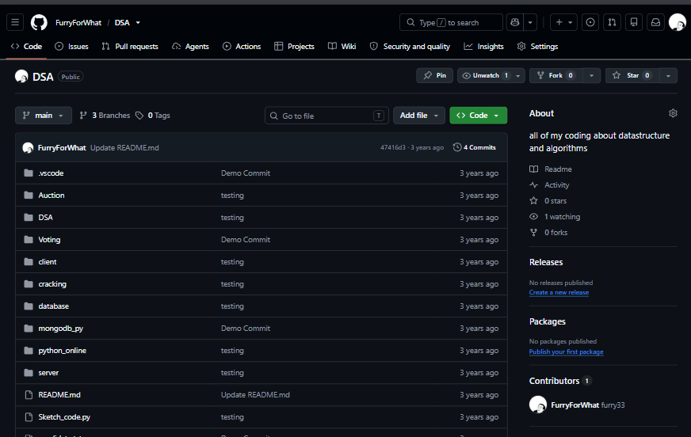

<!--
  Marp template — "pitch-bold"
  Copy into your repo (e.g. slides/intro.md), replace content.
  Render:  marp slides/intro.md -o slides.html   (or .pdf / .png)
  Big type, high contrast — good for a fast PechaKucha-style pitch.
-->
---
marp: true
paginate: true
size: 16:9
---

<!-- _class: cover -->

# EazyPortfolio

## An agent pipeline that turns commit history into a portfolio

**KoFurry** · @FurryForWhat

---

<!-- _class: lead -->

# The problem

Your commit history already tells your story — but recruiters don't read `git log`.

---

# The fix

- **What** — An agent pipeline that reads your GitHub repos and writes portfolio cards
- **Who** — Developers who build in public but never update their portfolio
- **Why** — The work should update the portfolio. Not the other way around.

---

# How it works

| Layer | Job |
|---|---|
| **Skills** | Define output rules + evidence requirements |
| **gh CLI** | Discover repos, clone, push |
| **Subagents** | Fetch → Analyze → Publish |
| **JSON** | Single source of truth |

One command: **`/update-portfolio`**

---

# Demo

---

<!-- _class: lead -->

# Try it

**https://eazyportfolio-mewnhx83c-furry-s-team.vercel.app/**

github.com/FurryForWhat/EazyPortfolio · MIT